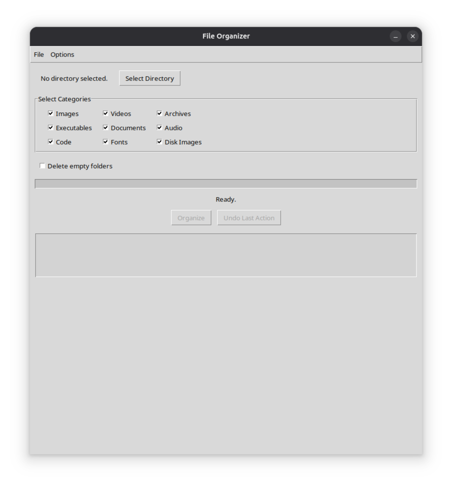
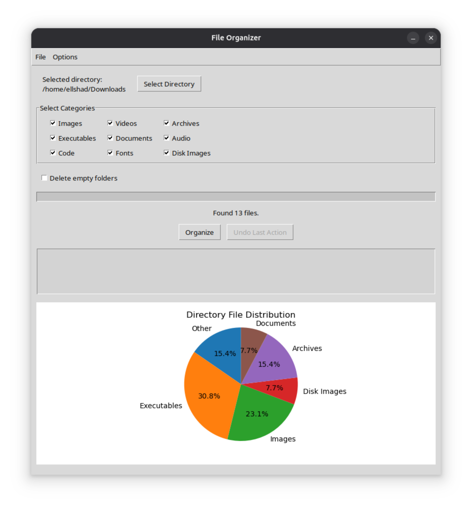
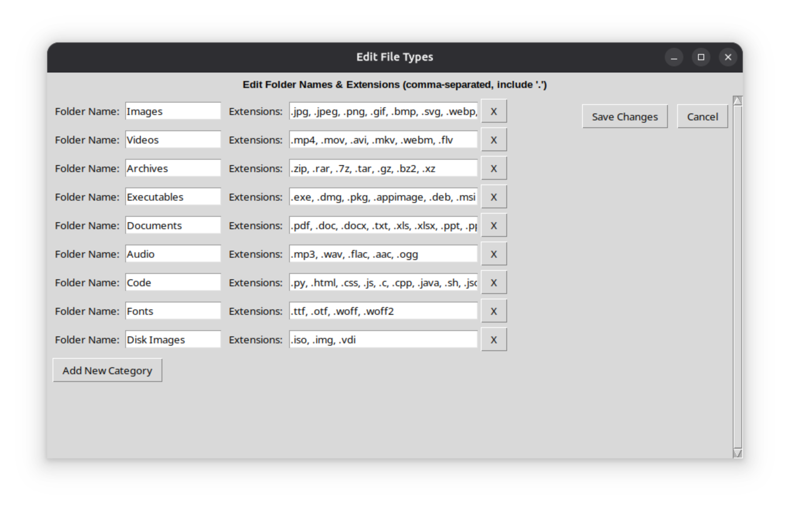

# File Organizer

[](https://opensource.org/licenses/MIT)
[](https://github.com/ell-shad/file-organizer/releases)

A powerful GUI application for organizing files by category on Linux systems.


## Features

- 📁 Automatically organize files by type (Images, Videos, Documents, etc.)
- 🔄 Undo support - reverse your last organization
- 📊 Visual statistics with pie charts
- 🗑️ Optional empty folder deletion
- ⚙️ Customizable file type categories
- 🎨 Clean and intuitive GUI

## Supported File Types

- **Images**: JPG, PNG, GIF, BMP, SVG, WebP, TIFF
- **Videos**: MP4, MOV, AVI, MKV, WebM, FLV
- **Documents**: PDF, DOC, DOCX, TXT, XLS, XLSX, PPT, PPTX
- **Audio**: MP3, WAV, FLAC, AAC, OGG
- **Archives**: ZIP, RAR, 7Z, TAR, GZ
- **Code**: PY, HTML, CSS, JS, C, CPP, JAVA, JSON, XML
- And more...

## Installation

### Debian/Ubuntu (Recommended)

Download the latest `.deb` package from [Releases](https://github.com/ell-shad/file-organizer/releases) and install:
```bash
sudo dpkg -i file-organizer_1.0.0_all.deb
```

Or double-click the .deb file in your file manager.

### From Source
```bash
# Clone the repository
git clone https://github.com/ell-shad/file-organizer.git
cd file-organizer

# Install dependencies
sudo apt-get install python3 python3-tk python3-pip
pip3 install matplotlib

# Run the application
python3 file_organizer.py
```

## Usage

1. Launch "File Organizer" from your applications menu
2. Click "Select Directory" and choose the folder to organize
3. Select which file categories you want to organize
4. Click "Organize" to sort files into category folders
5. Use "Undo Last Action" if needed

## Building from Source

To build the .deb package yourself:
```bash
chmod +x build-deb.sh
./build-deb.sh
sudo dpkg -i file-organizer.deb
```

## Uninstallation
```bash
sudo dpkg -r file-organizer
```

## Requirements

- Python 3.8 or higher
- Tkinter (python3-tk)
- Matplotlib

## Screenshots

### Main Window


### File Statistics


### File Type Extensions


## Contributing

Contributions are welcome! Please feel free to submit a Pull Request.

1. Fork the project
2. Create your feature branch (`git checkout -b feature/AmazingFeature`)
3. Commit your changes (`git commit -m 'Add some AmazingFeature'`)
4. Push to the branch (`git push origin feature/AmazingFeature`)
5. Open a Pull Request

## License

This project is licensed under the MIT License - see the [LICENSE](LICENSE) file for details.

## Author

**Elshad Guliyev**
- GitHub: [@ell-shad](https://github.com/ell-shad)
- Email: ellshad.012@gmail.com

## Acknowledgments

- Built with Python and Tkinter
- Uses Matplotlib for data visualization
- The utilization of AI tools, namely Anthropic Claude and Google Gemini, occurred in various stages of the application's production. These tools were employed in conjunction with human modification and review processes.

## Changelog

See [CHANGELOG.md](CHANGELOG.md) for version history.

## Support

If you encounter any issues, please [open an issue](https://github.com/ell-shad/file-organizer/issues) on GitHub.

---
⭐ Star this repository if you find it helpful!
