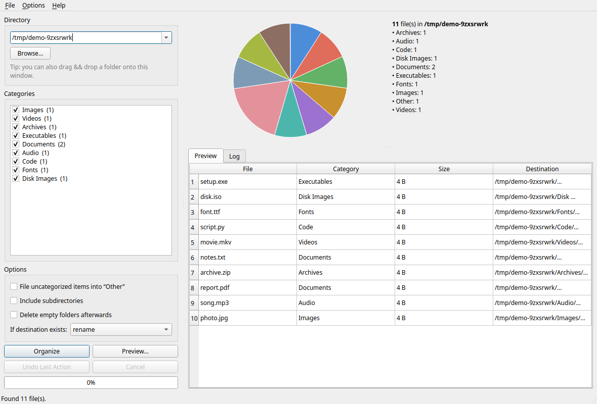

# File Organizer

[](https://opensource.org/licenses/MIT)
[](https://github.com/ell-shad/file-organizer/actions/workflows/ci.yml)
[](https://github.com/ell-shad/file-organizer/releases)

A modern GUI application for organizing files by category on Linux.



## Features (v2.0)

- 📁 Organize files by type (Images, Videos, Documents, …) with **live preview**
- 🖥️ Modern, **resizable, HiDPI-aware Qt interface** (no more fixed 800×800 window)
- 🔄 Undo support — reverse your last organization, even via CLI
- 🛡️ **Never silently overwrites**: name clashes become `photo (1).jpg` by default
- 📊 Built-in distribution chart (no heavy matplotlib dependency for the Qt UI)
- ⚙️ Customizable categories with validation (blocks `..`, `/`, absolute paths)
- 🗑️ Conservative empty-folder cleanup (hidden folders & symlinks never touched)
- ⌨️ Scriptable CLI: `scan`, `organize --dry-run`, `undo`
- 🐧 Debian-first: **.deb**, self-contained binary (Qt bundled in), portable tarball, or run from source

## Installation (Debian / Ubuntu / Mint / Pop!_OS …)

### Native package (recommended)

```bash
sudo apt install ./file-organizer_2.0.0_all.deb
```

Get the `.deb` from [Releases](https://github.com/ell-shad/file-organizer/releases)
or build it: `./build-deb.sh`.

### Self-contained binary (no Python, no Qt, nothing to install)

Download the `file-organizer` binary from [Releases](https://github.com/ell-shad/file-organizer/releases),
`chmod +x` it, run it. PySide6/Qt is bundled inside, so it works on any
Debian-based system without apt, pip, or Python:

```bash
./file-organizer                    # GUI
./file-organizer organize ~/Downloads --dry-run
```

Build it yourself with `./build-standalone.sh` (needs `pip install pyinstaller PySide6`).

### Run without installing

No root, no `.deb` — straight from a source checkout:

```bash
git clone https://github.com/ell-shad/file-organizer.git
cd file-organizer
./run.sh scan ~/Downloads                  # CLI: standard library only, always works
./run.sh organize ~/Downloads --dry-run
./run.sh                                   # GUI (see below)
```

The CLI needs nothing but Python 3.9+. The GUI needs one of:
- Qt interface: `sudo apt install python3-pyside6` (modern UI), or
- Legacy Tk interface: `sudo apt install python3-tk` + `./run.sh gui --toolkit tk`
  (no pip packages required).

To get Qt without touching system packages:
```bash
python3 -m venv /tmp/fo && /tmp/fo/bin/pip install PySide6
PYTHONPATH=src /tmp/fo/bin/python -m file_organizer gui
```

### Portable (no root)

Download `file-organizer-*-portable.tar.gz` from Releases, extract, run
`./file-organizer-portable.sh` (needs `python3-pyside6` + `python3-tk` from apt).

## Usage

**GUI:** launch *File Organizer* from your app menu (or run `file-organizer`),
pick a folder (or drag & drop it), tick categories, hit **Preview…**,
then **Organize**.

**CLI:**

```bash
file-organizer scan ~/Downloads
file-organizer organize ~/Downloads --dry-run
file-organizer organize ~/Downloads --only Images,Documents --conflict rename
file-organizer organize ~/Downloads --include-other --delete-empty
file-organizer undo
```

See `man file-organizer` after installing, or `file-organizer organize --help`.

## Safety notes

- Default conflict policy is `rename` — existing destination files are
  **never** replaced unless you explicitly choose `--conflict overwrite`
  (the GUI asks for confirmation in that mode).
- Folder names are validated: `..`, path separators, and absolute paths
  are rejected in the category editor.
- Empty-folder cleanup skips hidden directories, symlinks, and anything
  outside the target folder.
- Symlinks are listed but never moved or followed.

## Building & testing

```bash
PYTHONPATH=src python -m pytest tests/ -q   # 35 tests, no Qt required
./build-deb.sh --output-dir dist              # .deb
./build-all.sh --output-dir dist              # .deb + tarball + portable
./build-standalone.sh dist                    # self-contained binary (PyInstaller)
```

Pushing a `v*` tag runs `.github/workflows/release.yml`, which tests,
builds everything, and publishes a GitHub Release with artifacts.

## Project layout

| Path | What |
|---|---|
| `src/file_organizer/core.py` | GUI-independent logic (moves, undo, scan, validation) |
| `src/file_organizer/gui_qt.py` | Qt interface (default) |
| `src/file_organizer/gui_tk_legacy.py` | Frozen v1 Tk fallback |
| `src/file_organizer/cli.py` | `scan`/`organize`/`undo`/`categories`/`gui` |
| `src/file_organizer/config.py` | XDG JSON settings |
| `tests/` | pytest suite |
| `DEBIAN/`, `build-deb.sh`, `build-all.sh` | Debian packaging |
| `build-standalone.sh`, `packaging/` | PyInstaller self-contained binary |
| `.github/workflows/` | CI + automated releases |

Legacy v1 screenshots are kept under `screenshots/` (`main-window.png`,
`statistics.png`, `file_types.png`) for reference.

## Contributing

Please read [CONTRIBUTING.md](CONTRIBUTING.md) — especially the safety
rules — then open a PR. Bug reports: use the issue templates.

## License

MIT — see [LICENSE](LICENSE).

## Author

**Elshad Guliyev** — [@ell-shad](https://github.com/ell-shad) · ellshad.012@gmail.com

## Changelog

See [CHANGELOG.md](CHANGELOG.md).

---

⭐ Star this repository if you find it helpful!
